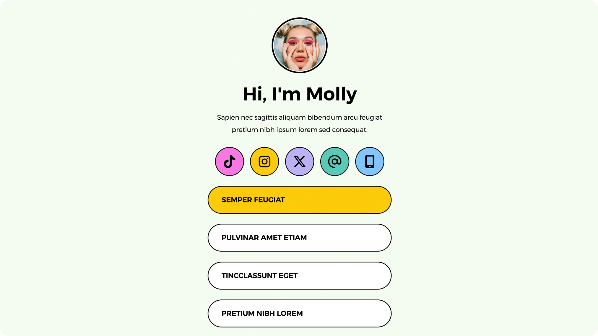

# Template 224 - Carrd Clone

<!--  -->

A recreation of a Carrd template built from scratch using HTML, CSS, and JavaScript to practice front-end development skills.

<!-- ✨ [Live Demo](YOUR_GITHUB_PAGES_URL_HERE) -->

[  **Original Template:** [224](https://196eee93a9b8aedc.demo.carrd.co/) ]

---

<!-- ## 📋 What I Built
- [x] Responsive layout matching the original design
- [x] Interactive elements and animations
- [x] Cross-browser compatibility
- [x] Mobile-first approach
- [ ] *Add any additional features you implemented*

## 🛠️ Technologies Used
- HTML5
- CSS3 (Flexbox/Grid)
- Vanilla JavaScript
- *Add any additional tools/libraries you used*

## 💡 What I Learned
- *Specific techniques you picked up (e.g., "CSS Grid for complex layouts")*
- *Challenges you overcame (e.g., "Creating smooth scroll animations")*
- *New concepts you discovered (e.g., "Advanced CSS selectors")*

## 🎨 Key Features Recreated
- *List the main visual/interactive elements you replicated*
- *Any tricky bits you're particularly proud of*

## 📱 Responsive Design
Fully responsive across:
- Desktop (1200px+)
- Tablet (768px - 1199px)  
- Mobile (320px - 767px) -->


### Setup & Installation
1. Clone this repository
   ```bash
   git clone https://github.com/yourusername/repository-name.git
   ```
2. Open `index.html` in your browser
3. That's it! No build process required.

---

### Notes
This project is for educational purposes only. All design credit goes to the original Carrd template creator. This recreation demonstrates technical implementation skills rather than design originality.